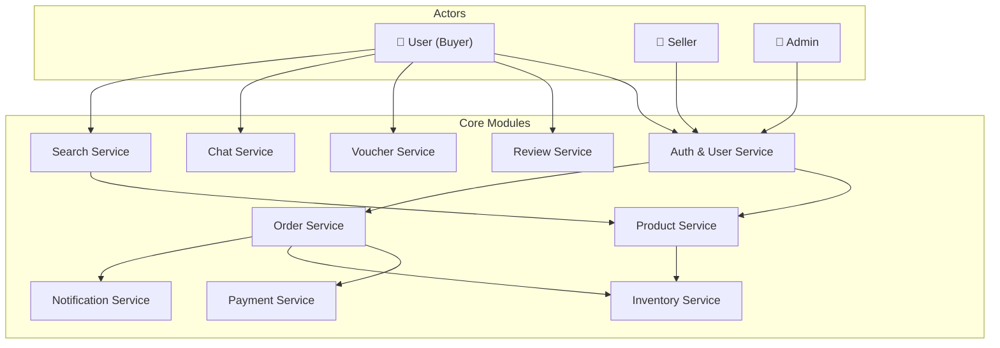
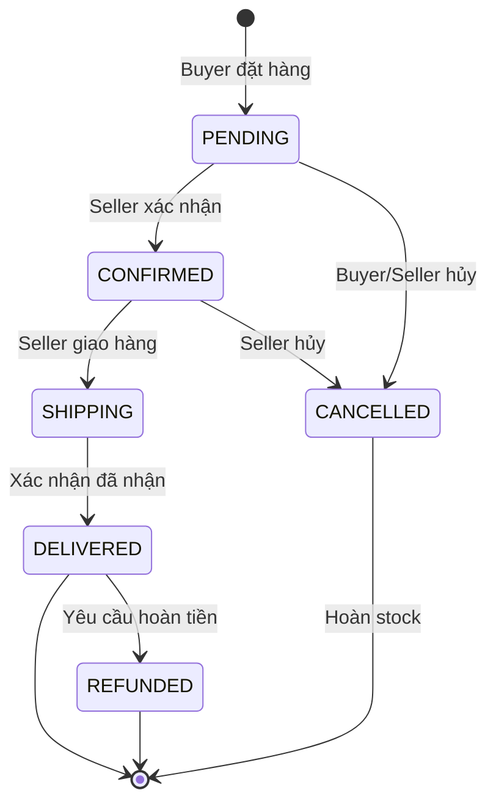
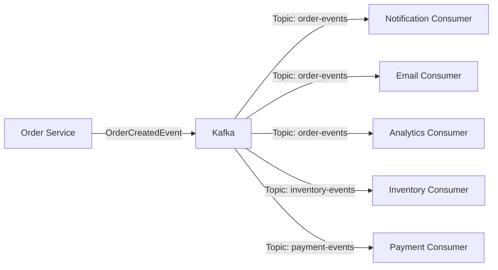
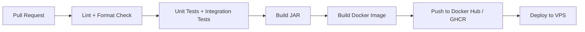
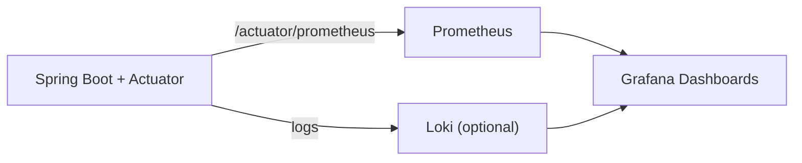
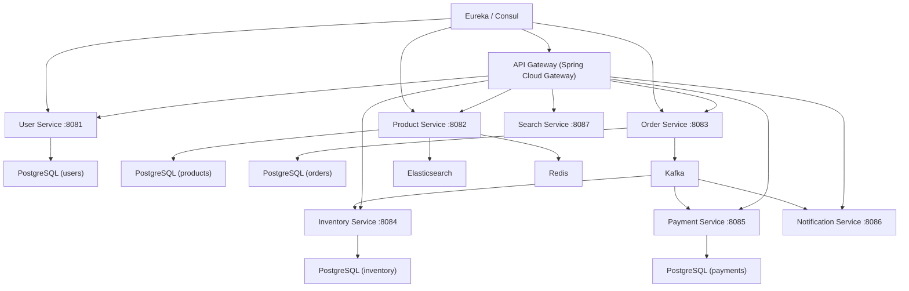
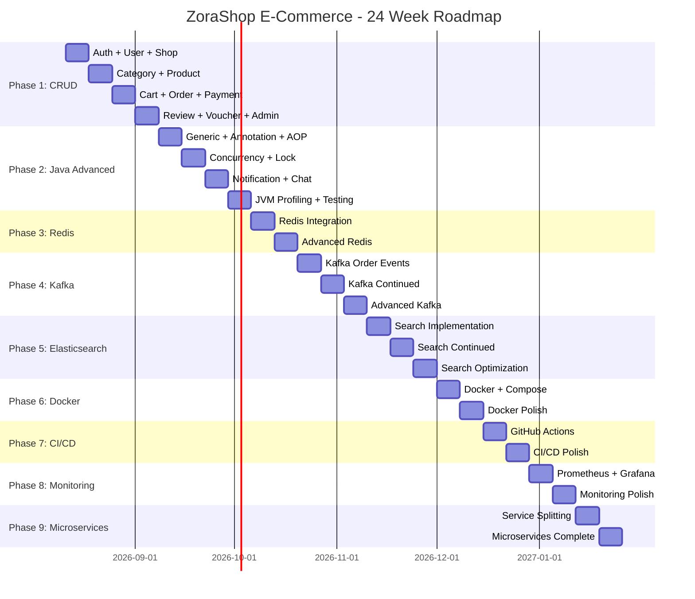

# 🛒 E-Commerce Platform — Implementation Plan

> **Project Name:** ZoraShop — Mini Shopee E-Commerce Platform  
> **Target:** Java Backend Intern → Fresher → Middle (2–3 năm)  
> **Duration:** 24 tuần (~6 tháng)  
> **Tech Stack chính:** Spring Boot, PostgreSQL, Redis, Kafka, Elasticsearch, Docker, Prometheus/Grafana  
> **Start Date:** 2026-08-11  
> **Focus:** Backend only (Swagger/Postman test → AI frontend sau)

---

## Tổng quan hệ thống



---

## Database Schema Overview

```mermaid
erDiagram
    USERS {
        bigint id PK
        varchar email UK
        varchar password
        varchar full_name
        varchar phone
        varchar avatar_url
        enum role "BUYER, SELLER, ADMIN"
        boolean is_active
        timestamp created_at
        timestamp updated_at
    }

    ADDRESSES {
        bigint id PK
        bigint user_id FK
        varchar full_name
        varchar phone
        varchar street
        varchar ward
        varchar district
        varchar city
        boolean is_default
    }

    SHOPS {
        bigint id PK
        bigint seller_id FK
        varchar name
        varchar description
        varchar logo_url
        varchar banner_url
        double rating
        int total_products
        int total_followers
        boolean is_active
        timestamp created_at
    }

    CATEGORIES {
        bigint id PK
        bigint parent_id FK
        varchar name
        varchar slug UK
        varchar icon_url
        int level
        int sort_order
        boolean is_active
    }

    PRODUCTS {
        bigint id PK
        bigint shop_id FK
        bigint category_id FK
        varchar name
        varchar slug UK
        text description
        decimal price
        decimal original_price
        int sold_count
        double rating_avg
        int rating_count
        bigint view_count
        enum status "ACTIVE, INACTIVE, BANNED"
        timestamp created_at
        timestamp updated_at
    }

    PRODUCT_IMAGES {
        bigint id PK
        bigint product_id FK
        varchar image_url
        int sort_order
        boolean is_primary
    }

    PRODUCT_VARIANTS {
        bigint id PK
        bigint product_id FK
        varchar variant_name
        varchar sku UK
        decimal price
        int stock
        varchar image_url
    }

    INVENTORY {
        bigint id PK
        bigint variant_id FK
        int quantity
        int reserved
        int available
        int version "Optimistic Lock"
    }

    INVENTORY_LOGS {
        bigint id PK
        bigint inventory_id FK
        enum type "IN, OUT, RESERVED, RELEASED"
        int quantity_change
        int quantity_after
        varchar reason
        bigint reference_id
        timestamp created_at
    }

    CARTS {
        bigint id PK
        bigint user_id FK
        timestamp updated_at
    }

    CART_ITEMS {
        bigint id PK
        bigint cart_id FK
        bigint variant_id FK
        int quantity
        timestamp added_at
    }

    ORDERS {
        bigint id PK
        varchar order_number UK
        bigint user_id FK
        bigint shop_id FK
        bigint address_id FK
        bigint voucher_id FK
        decimal subtotal
        decimal shipping_fee
        decimal discount_amount
        decimal total_amount
        enum status "PENDING, CONFIRMED, SHIPPING, DELIVERED, CANCELLED, REFUNDED"
        varchar note
        timestamp created_at
        timestamp updated_at
    }

    ORDER_ITEMS {
        bigint id PK
        bigint order_id FK
        bigint variant_id FK
        varchar product_name
        varchar variant_name
        decimal price
        int quantity
        decimal subtotal
    }

    PAYMENTS {
        bigint id PK
        bigint order_id FK
        varchar transaction_id UK
        enum method "COD, BANK_TRANSFER, E_WALLET, CREDIT_CARD"
        enum status "PENDING, COMPLETED, FAILED, REFUNDED"
        decimal amount
        varchar provider
        text metadata
        timestamp paid_at
        timestamp created_at
    }

    REVIEWS {
        bigint id PK
        bigint user_id FK
        bigint product_id FK
        bigint order_item_id FK
        int rating
        text comment
        boolean is_anonymous
        timestamp created_at
        timestamp updated_at
    }

    REVIEW_IMAGES {
        bigint id PK
        bigint review_id FK
        varchar image_url
    }

    REVIEW_REPLIES {
        bigint id PK
        bigint review_id FK
        bigint seller_id FK
        text content
        timestamp created_at
    }

    VOUCHERS {
        bigint id PK
        bigint shop_id FK "nullable = Platform voucher"
        varchar code UK
        varchar name
        text description
        enum type "PERCENTAGE, FIXED_AMOUNT, FREE_SHIPPING"
        decimal value
        decimal min_order_amount
        decimal max_discount
        int total_quantity
        int used_quantity
        timestamp start_date
        timestamp end_date
        boolean is_active
    }

    USER_VOUCHERS {
        bigint id PK
        bigint user_id FK
        bigint voucher_id FK
        boolean is_used
        timestamp used_at
        timestamp claimed_at
    }

    NOTIFICATIONS {
        bigint id PK
        bigint user_id FK
        enum type "ORDER, PROMOTION, SYSTEM, CHAT"
        varchar title
        text content
        varchar link
        boolean is_read
        timestamp created_at
    }

    CHAT_ROOMS {
        bigint id PK
        bigint buyer_id FK
        bigint shop_id FK
        timestamp last_message_at
    }

    CHAT_MESSAGES {
        bigint id PK
        bigint room_id FK
        bigint sender_id FK
        enum type "TEXT, IMAGE, PRODUCT_LINK, ORDER_LINK"
        text content
        boolean is_read
        timestamp created_at
    }

    USERS ||--o{ ADDRESSES : "has"
    USERS ||--o| SHOPS : "owns"
    SHOPS ||--o{ PRODUCTS : "sells"
    CATEGORIES ||--o{ PRODUCTS : "contains"
    CATEGORIES ||--o{ CATEGORIES : "parent-child"
    PRODUCTS ||--o{ PRODUCT_IMAGES : "has"
    PRODUCTS ||--o{ PRODUCT_VARIANTS : "has"
    PRODUCT_VARIANTS ||--|| INVENTORY : "tracks"
    INVENTORY ||--o{ INVENTORY_LOGS : "logs"
    USERS ||--|| CARTS : "has"
    CARTS ||--o{ CART_ITEMS : "contains"
    USERS ||--o{ ORDERS : "places"
    SHOPS ||--o{ ORDERS : "receives"
    ORDERS ||--o{ ORDER_ITEMS : "contains"
    ORDERS ||--|| PAYMENTS : "has"
    USERS ||--o{ REVIEWS : "writes"
    PRODUCTS ||--o{ REVIEWS : "receives"
    REVIEWS ||--o{ REVIEW_IMAGES : "has"
    REVIEWS ||--o| REVIEW_REPLIES : "has"
    SHOPS ||--o{ VOUCHERS : "creates"
    USERS ||--o{ USER_VOUCHERS : "claims"
    USERS ||--o{ NOTIFICATIONS : "receives"
    USERS ||--o{ CHAT_ROOMS : "participates"
    CHAT_ROOMS ||--o{ CHAT_MESSAGES : "contains"
```



---

## Decisions (Resolved)

| Question | Decision | Chi tiết |
|---|---|---|
| **Frontend** | Backend-only | Tập trung 100% backend. Dùng Swagger UI + Postman để test API. Frontend sẽ nhờ AI làm sau khi backend hoàn chỉnh. |
| **File Upload** | MinIO (S3-compatible) | Self-hosted, S3-compatible API. Tốt cho học DevOps. Chạy trong Docker. |
| **Email** | Mailtrap (sandbox) | An toàn cho dev, không gửi email thật ra ngoài. Free tier đủ dùng. |
| **Payment** | VNPay Sandbox | Phase 1 mock payment. Phase 4+ tích hợp VNPay Sandbox API thật. |

---

## Project Structure (Phase 1 — Monolith)

```
zorashop/
├── src/main/java/com/zorashop/
│   ├── ZoraShopApplication.java
│   ├── config/
│   │   ├── SecurityConfig.java
│   │   ├── JwtConfig.java
│   │   ├── SwaggerConfig.java
│   │   ├── WebConfig.java
│   │   └── AuditConfig.java
│   ├── security/
│   │   ├── JwtTokenProvider.java
│   │   ├── JwtAuthenticationFilter.java
│   │   ├── CustomUserDetailsService.java
│   │   └── SecurityUtils.java
│   ├── common/
│   │   ├── base/
│   │   │   ├── BaseEntity.java
│   │   │   ├── BaseRepository.java
│   │   │   ├── BaseService.java
│   │   │   └── BaseResponse.java
│   │   ├── dto/
│   │   │   ├── ApiResponse.java
│   │   │   ├── PageResponse.java
│   │   │   └── ErrorResponse.java
│   │   ├── exception/
│   │   │   ├── GlobalExceptionHandler.java
│   │   │   ├── ResourceNotFoundException.java
│   │   │   ├── DuplicateResourceException.java
│   │   │   ├── UnauthorizedException.java
│   │   │   ├── ForbiddenException.java
│   │   │   ├── BadRequestException.java
│   │   │   └── InsufficientStockException.java
│   │   ├── annotation/
│   │   │   ├── CurrentUser.java
│   │   │   ├── Permission.java
│   │   │   └── LogExecutionTime.java
│   │   ├── aspect/
│   │   │   ├── LoggingAspect.java
│   │   │   └── PermissionAspect.java
│   │   ├── enums/
│   │   │   ├── Role.java
│   │   │   ├── OrderStatus.java
│   │   │   ├── PaymentMethod.java
│   │   │   ├── PaymentStatus.java
│   │   │   └── NotificationType.java
│   │   └── util/
│   │       ├── SlugUtils.java
│   │       └── DateUtils.java
│   │   └── config/
│   │       └── MinioConfig.java
│   ├── module/
│   │   ├── user/
│   │   │   ├── entity/User.java
│   │   │   ├── entity/Address.java
│   │   │   ├── repository/UserRepository.java
│   │   │   ├── repository/AddressRepository.java
│   │   │   ├── service/UserService.java
│   │   │   ├── service/impl/UserServiceImpl.java
│   │   │   ├── dto/request/RegisterRequest.java
│   │   │   ├── dto/request/LoginRequest.java
│   │   │   ├── dto/request/UpdateProfileRequest.java
│   │   │   ├── dto/response/UserResponse.java
│   │   │   ├── dto/response/LoginResponse.java
│   │   │   ├── controller/AuthController.java
│   │   │   ├── controller/UserController.java
│   │   │   └── mapper/UserMapper.java
│   │   ├── file/
│   │   │   ├── service/FileStorageService.java
│   │   │   ├── service/impl/MinioStorageService.java
│   │   │   └── controller/FileController.java
│   │   ├── shop/
│   │   │   ├── entity/Shop.java
│   │   │   ├── repository/ShopRepository.java
│   │   │   ├── service/ShopService.java
│   │   │   ├── service/impl/ShopServiceImpl.java
│   │   │   ├── dto/request/...
│   │   │   ├── dto/response/...
│   │   │   ├── controller/ShopController.java
│   │   │   └── mapper/ShopMapper.java
│   │   ├── category/
│   │   │   └── ... (tương tự)
│   │   ├── product/
│   │   │   └── ...
│   │   ├── inventory/
│   │   │   └── ...
│   │   ├── cart/
│   │   │   └── ...
│   │   ├── order/
│   │   │   └── ...
│   │   ├── payment/
│   │   │   └── ...
│   │   ├── review/
│   │   │   └── ...
│   │   ├── voucher/
│   │   │   └── ...
│   │   ├── notification/
│   │   │   └── ...
│   │   ├── chat/
│   │   │   └── ...
│   │   └── search/
│   │       └── ...
│   └── event/
│       ├── OrderCreatedEvent.java
│       ├── PaymentCompletedEvent.java
│       └── ...
├── src/main/resources/
│   ├── application.yml
│   ├── application-dev.yml
│   ├── application-prod.yml
│   └── db/migration/
│       ├── V1__create_users_table.sql
│       ├── V2__create_shops_table.sql
│       ├── V3__create_categories_table.sql
│       ├── V4__create_products_table.sql
│       └── ...
├── src/test/java/com/zorashop/
│   ├── module/user/...
│   ├── module/product/...
│   └── ...
├── docker-compose.yml
├── Dockerfile
├── pom.xml
└── README.md
```


## Phase 1 — CRUD Foundation (Tuần 1–4)

### Mục tiêu
Xây dựng toàn bộ CRUD chuẩn cho các module chính. Đảm bảo code sạch, validation đúng, exception handling thống nhất, và API documentation hoàn chỉnh.

### Tech Stack
| Công nghệ | Version | Mục đích |
|---|---|---|
| Java | 17+ | Language |
| Spring Boot | 3.2+ | Framework |
| Spring Security | 6.x | Authentication & Authorization |
| Spring Data JPA | 3.2+ | ORM |
| PostgreSQL | 16+ | Database |
| Flyway | 10+ | DB Migration |
| MapStruct | 1.5+ | DTO Mapping |
| Lombok | 1.18+ | Boilerplate reduction |
| SpringDoc OpenAPI | 2.3+ | Swagger UI |
| JUnit 5 | 5.10+ | Testing |
| Mockito | 5+ | Mocking |
| MinIO SDK | 8.5+ | S3-compatible file storage |
| Mailtrap | — | Email sandbox |

---

### Tuần 1: Auth + User + Shop Module

#### Sprint Goal
> User có thể đăng ký, đăng nhập, quản lý profile. Seller có thể tạo shop.

#### User Stories

| ID | Role | Story | Priority | Acceptance Criteria |
|---|---|---|---|---|
| US-001 | Buyer | Tôi muốn đăng ký tài khoản bằng email và password | P0 | Email unique, password >= 8 ký tự, hash BCrypt, trả JWT |
| US-002 | User | Tôi muốn đăng nhập để truy cập hệ thống | P0 | Login bằng email/password, trả access token + refresh token |
| US-003 | User | Tôi muốn xem và sửa thông tin cá nhân | P0 | Xem/sửa name, phone, avatar. Không sửa được email |
| US-004 | User | Tôi muốn quản lý danh sách địa chỉ giao hàng | P1 | CRUD addresses, set default, max 10 địa chỉ |
| US-005 | User | Tôi muốn đổi mật khẩu | P1 | Xác nhận old password, validate new password |
| US-006 | Seller | Tôi muốn tạo shop để bắt đầu bán hàng | P0 | 1 user = 1 shop, role chuyển thành SELLER |
| US-007 | Seller | Tôi muốn cập nhật thông tin shop | P1 | Sửa name, description, logo, banner |
| US-008 | Admin | Tôi muốn xem danh sách users và quản lý trạng thái | P1 | List users, search, filter, activate/deactivate |

#### API Endpoints

```
POST   /api/v1/auth/register           → Đăng ký
POST   /api/v1/auth/login              → Đăng nhập
POST   /api/v1/auth/refresh-token      → Refresh JWT

GET    /api/v1/users/me                → Profile hiện tại
PUT    /api/v1/users/me                → Cập nhật profile
PUT    /api/v1/users/me/password       → Đổi mật khẩu
POST   /api/v1/users/me/avatar        → Upload avatar

GET    /api/v1/users/me/addresses      → Danh sách địa chỉ
POST   /api/v1/users/me/addresses      → Thêm địa chỉ
PUT    /api/v1/users/me/addresses/{id} → Sửa địa chỉ
DELETE /api/v1/users/me/addresses/{id} → Xóa địa chỉ
PUT    /api/v1/users/me/addresses/{id}/default → Set default

POST   /api/v1/shops                   → Tạo shop (Seller)
GET    /api/v1/shops/{id}              → Xem shop
PUT    /api/v1/shops/{id}              → Cập nhật shop (Owner)

GET    /api/v1/admin/users             → List users (Admin)
PUT    /api/v1/admin/users/{id}/status → Activate/Deactivate (Admin)
```

#### Tasks

| Task ID | Task | File(s) | Estimate | Dependencies |
|---|---|---|---|---|
| T1-001 | Init Spring Boot project, cấu hình PostgreSQL, Flyway | `pom.xml`, `application.yml` | 2h | — |
| T1-002 | Tạo `BaseEntity` (id, createdAt, updatedAt) | `BaseEntity.java` | 0.5h | T1-001 |
| T1-003 | Tạo `ApiResponse<T>`, `PageResponse<T>`, `ErrorResponse` | `common/dto/` | 1h | T1-001 |
| T1-004 | Tạo `GlobalExceptionHandler` + custom exceptions | `common/exception/` | 2h | T1-003 |
| T1-005 | Tạo `User` entity + migration V1 | `User.java`, `V1__create_users.sql` | 1h | T1-002 |
| T1-006 | Tạo `UserRepository`, `UserService`, `UserServiceImpl` | `user/` | 2h | T1-005 |
| T1-007 | Cấu hình Spring Security + JWT | `SecurityConfig.java`, `JwtTokenProvider.java`, `JwtAuthenticationFilter.java` | 4h | T1-005 |
| T1-008 | Tạo `AuthController` (register, login, refresh) | `AuthController.java` | 3h | T1-007 |
| T1-009 | Tạo `UserController` (profile CRUD) | `UserController.java` | 2h | T1-007 |
| T1-010 | Tạo `Address` entity + CRUD | `Address.java`, `AddressController.java` | 2h | T1-006 |
| T1-011 | Tạo `Shop` entity + CRUD | `Shop.java`, `ShopController.java` | 2h | T1-006 |
| T1-012 | Cấu hình Swagger/OpenAPI | `SwaggerConfig.java` | 1h | T1-008 |
| T1-013 | Viết Unit Tests cho UserService | `UserServiceTest.java` | 2h | T1-006 |
| T1-014 | Viết Integration Tests cho AuthController | `AuthControllerTest.java` | 2h | T1-008 |
| **Total** | | | **~26h** | |

#### Definition of Done (Tuần 1)
- [ ] Đăng ký / đăng nhập thành công qua Swagger
- [ ] JWT authentication hoạt động cho tất cả protected endpoints
- [ ] Role-based access: BUYER, SELLER, ADMIN
- [ ] Validation error trả về format thống nhất
- [ ] Unit test coverage >= 70% cho UserService
- [ ] Code review checklist: no N+1, no SQL injection, passwords hashed

---

### Tuần 2: Category + Product + Inventory Module

#### Sprint Goal
> Seller có thể tạo sản phẩm với variants và quản lý tồn kho. Buyer có thể browse sản phẩm.

#### User Stories

| ID | Role | Story | Priority | Acceptance Criteria |
|---|---|---|---|---|
| US-009 | Admin | Tôi muốn quản lý danh mục sản phẩm (tree structure) | P0 | CRUD categories, hỗ trợ parent-child 3 cấp |
| US-010 | Seller | Tôi muốn tạo sản phẩm với nhiều biến thể (size, color) | P0 | Tạo product + variants + images, auto-gen slug |
| US-011 | Seller | Tôi muốn sửa/xóa sản phẩm của shop mình | P0 | Chỉ owner mới sửa/xóa được |
| US-012 | Buyer | Tôi muốn xem danh sách sản phẩm theo danh mục | P0 | Pagination, sort by price/rating/sold, filter |
| US-013 | Buyer | Tôi muốn xem chi tiết sản phẩm | P0 | Hiển thị product + variants + shop info + images |
| US-014 | Seller | Tôi muốn quản lý tồn kho của từng variant | P1 | Xem stock, cập nhật stock, xem inventory logs |
| US-015 | Admin | Tôi muốn duyệt/ban sản phẩm | P1 | Đổi status: ACTIVE/INACTIVE/BANNED |

#### API Endpoints

```
# Category
GET    /api/v1/categories              → List categories (tree)
GET    /api/v1/categories/{id}         → Category detail
POST   /api/v1/admin/categories        → Tạo category (Admin)
PUT    /api/v1/admin/categories/{id}   → Sửa category (Admin)
DELETE /api/v1/admin/categories/{id}   → Xóa category (Admin)

# Product
GET    /api/v1/products                → List products (public, filter, paginate)
GET    /api/v1/products/{slug}         → Product detail (public)
POST   /api/v1/seller/products         → Tạo product (Seller)
PUT    /api/v1/seller/products/{id}    → Sửa product (Seller, owner only)
DELETE /api/v1/seller/products/{id}    → Xóa product (Seller, owner only)
GET    /api/v1/seller/products         → List my products (Seller)
POST   /api/v1/seller/products/{id}/images → Upload images

# Inventory
GET    /api/v1/seller/inventory                → List inventory (Seller)
PUT    /api/v1/seller/inventory/{variantId}    → Update stock
GET    /api/v1/seller/inventory/{variantId}/logs → Inventory logs
```

#### Tasks

| Task ID | Task | File(s) | Estimate | Dependencies |
|---|---|---|---|---|
| T2-001 | Tạo `Category` entity + migration, tree structure | `Category.java` | 2h | Tuần 1 |
| T2-002 | CategoryService + Controller (CRUD) | `category/` | 3h | T2-001 |
| T2-003 | Tạo `Product`, `ProductImage`, `ProductVariant` entities | `product/entity/` | 2h | T2-001 |
| T2-004 | Product migrations V3, V4 | `db/migration/` | 1h | T2-003 |
| T2-005 | ProductService (create with variants + images) | `ProductService.java` | 4h | T2-004 |
| T2-006 | Product listing API (filter, sort, paginate) | `ProductController.java` | 3h | T2-005 |
| T2-007 | Product detail API (join variants, images, shop) | `ProductController.java` | 2h | T2-005 |
| T2-008 | Seller product management APIs | `SellerProductController.java` | 2h | T2-005 |
| T2-009 | Tạo `Inventory`, `InventoryLog` entities | `inventory/entity/` | 1h | T2-003 |
| T2-010 | InventoryService (update stock, log changes) | `InventoryService.java` | 2h | T2-009 |
| T2-011 | Product Specification (dynamic filtering) | `ProductSpecification.java` | 2h | T2-006 |
| T2-012 | Unit Tests + Integration Tests | `test/` | 3h | T2-010 |
| **Total** | | | **~27h** | |

#### Definition of Done (Tuần 2)
- [ ] Seller tạo product với variants thành công
- [ ] Product listing hỗ trợ filter by category, price range, sort
- [ ] Inventory auto-created khi tạo variant
- [ ] Slug auto-generated, unique
- [ ] Seller chỉ quản lý được products của shop mình

---

### Tuần 3: Cart + Order + Payment Module

#### Sprint Goal
> Buyer có thể thêm sản phẩm vào giỏ hàng, đặt hàng, và thanh toán (mock).

#### User Stories

| ID | Role | Story | Priority | Acceptance Criteria |
|---|---|---|---|---|
| US-016 | Buyer | Tôi muốn thêm/sửa/xóa sản phẩm trong giỏ hàng | P0 | Add variant, update qty, remove, check stock |
| US-017 | Buyer | Tôi muốn xem giỏ hàng grouped theo shop | P0 | Group by shop, show subtotal per shop |
| US-018 | Buyer | Tôi muốn đặt hàng từ giỏ hàng | P0 | Chọn items, chọn address, tạo order, trừ stock |
| US-019 | Buyer | Tôi muốn xem lịch sử đơn hàng | P0 | List orders, filter by status, pagination |
| US-020 | Buyer | Tôi muốn xem chi tiết đơn hàng | P0 | Order info + items + payment + address |
| US-021 | Buyer | Tôi muốn hủy đơn hàng (trước khi ship) | P1 | Chỉ hủy khi status = PENDING/CONFIRMED, hoàn stock |
| US-022 | Seller | Tôi muốn xem và xử lý đơn hàng của shop | P0 | List orders, confirm, ship, update status |
| US-023 | Buyer | Tôi muốn thanh toán đơn hàng | P0 | Mock payment: COD hoặc giả lập bank transfer |

#### API Endpoints

```
# Cart
GET    /api/v1/cart                    → Xem giỏ hàng
POST   /api/v1/cart/items              → Thêm item
PUT    /api/v1/cart/items/{id}         → Sửa quantity
DELETE /api/v1/cart/items/{id}         → Xóa item
DELETE /api/v1/cart                    → Clear cart

# Order
POST   /api/v1/orders                 → Tạo đơn hàng
GET    /api/v1/orders                  → Lịch sử đơn hàng (Buyer)
GET    /api/v1/orders/{id}             → Chi tiết đơn hàng
PUT    /api/v1/orders/{id}/cancel      → Hủy đơn (Buyer)

# Seller Order Management
GET    /api/v1/seller/orders           → List orders (Seller)
PUT    /api/v1/seller/orders/{id}/confirm  → Xác nhận đơn
PUT    /api/v1/seller/orders/{id}/ship     → Giao hàng
PUT    /api/v1/seller/orders/{id}/deliver  → Đã giao

# Payment
POST   /api/v1/orders/{id}/payment     → Thanh toán
GET    /api/v1/orders/{id}/payment     → Xem trạng thái thanh toán
```

#### Order Flow (State Machine)



#### Tasks

| Task ID | Task | Estimate | Dependencies |
|---|---|---|---|
| T3-001 | Tạo `Cart`, `CartItem` entities + migration | 1h | Tuần 2 |
| T3-002 | CartService (add, update, remove, get grouped by shop) | 3h | T3-001 |
| T3-003 | CartController | 1h | T3-002 |
| T3-004 | Tạo `Order`, `OrderItem` entities + migration | 2h | T3-001 |
| T3-005 | OrderService — Place Order (validate stock, create order, deduct inventory) | 5h | T3-004 |
| T3-006 | OrderService — Cancel Order (restore stock, update status) | 2h | T3-005 |
| T3-007 | Order listing + detail APIs | 2h | T3-005 |
| T3-008 | Seller order management APIs | 2h | T3-005 |
| T3-009 | Tạo `Payment` entity + mock PaymentService | 3h | T3-005 |
| T3-010 | Order status transition validation | 1h | T3-005 |
| T3-011 | Tests | 3h | T3-009 |
| **Total** | | **~25h** | |

---

### Tuần 4: Review + Voucher + Admin Dashboard APIs

#### Sprint Goal
> Buyer đánh giá sản phẩm. Voucher system hoạt động. Admin có API quản trị.

#### User Stories

| ID | Role | Story | Priority | Acceptance Criteria |
|---|---|---|---|---|
| US-024 | Buyer | Tôi muốn đánh giá sản phẩm sau khi nhận hàng | P0 | Rating 1-5, comment, images. Chỉ review khi DELIVERED |
| US-025 | Buyer | Tôi muốn xem reviews của sản phẩm | P0 | List reviews, filter by rating, pagination |
| US-026 | Seller | Tôi muốn reply review của buyer | P1 | 1 reply per review, seller only |
| US-027 | Seller/Admin | Tôi muốn tạo voucher giảm giá | P0 | PERCENTAGE, FIXED, FREE_SHIP. Min order, max discount |
| US-028 | Buyer | Tôi muốn claim và sử dụng voucher khi đặt hàng | P0 | Claim voucher, apply khi checkout, validate conditions |
| US-029 | Admin | Tôi muốn xem dashboard thống kê | P1 | Total users, orders, revenue, top products |

#### API Endpoints

```
# Review
POST   /api/v1/products/{productId}/reviews    → Tạo review
GET    /api/v1/products/{productId}/reviews    → List reviews
POST   /api/v1/seller/reviews/{id}/reply       → Reply review (Seller)

# Voucher
POST   /api/v1/seller/vouchers                 → Tạo voucher (Seller)
GET    /api/v1/seller/vouchers                 → List my vouchers (Seller)
PUT    /api/v1/seller/vouchers/{id}            → Sửa voucher
GET    /api/v1/vouchers/available              → Vouchers khả dụng (Buyer)
POST   /api/v1/vouchers/{id}/claim             → Claim voucher (Buyer)
GET    /api/v1/users/me/vouchers               → My vouchers (Buyer)

# Admin Dashboard
GET    /api/v1/admin/dashboard/stats           → Thống kê tổng quan
GET    /api/v1/admin/dashboard/revenue         → Revenue chart data
GET    /api/v1/admin/dashboard/top-products    → Top selling products
POST   /api/v1/admin/vouchers                  → Tạo platform voucher (Admin)
```

#### Tasks

| Task ID | Task | Estimate | Dependencies |
|---|---|---|---|
| T4-001 | Review entity + migration | 1h | Tuần 3 |
| T4-002 | ReviewService (create, list, reply) | 3h | T4-001 |
| T4-003 | Update Product rating_avg on new review | 1h | T4-002 |
| T4-004 | Voucher entity + migration | 1h | — |
| T4-005 | VoucherService (CRUD, claim, validate, apply) | 4h | T4-004 |
| T4-006 | Integrate voucher vào Order flow | 2h | T4-005 |
| T4-007 | Admin Dashboard APIs (stats, revenue) | 3h | — |
| T4-008 | Admin moderation APIs (ban product, deactivate user) | 2h | — |
| T4-009 | Tests + Swagger documentation hoàn chỉnh | 3h | T4-008 |
| **Total** | | **~20h** | |

#### 🏁 Phase 1 Milestone Checklist
- [ ] Tất cả CRUD hoạt động chính xác
- [ ] JWT Auth + Role-based authorization
- [ ] Validation + Exception handling thống nhất
- [ ] Swagger UI đầy đủ tất cả endpoints
- [ ] Unit test coverage >= 70%
- [ ] Flyway migrations chạy clean
- [ ] Code follows conventions: DTO pattern, Service layer, Repository pattern
- [ ] No N+1 queries (check với `spring.jpa.show-sql=true`)

---

## Phase 2 — Java Advanced (Tuần 5–8)

### Mục tiêu
Refactor Phase 1 code bằng Java Advanced concepts. Áp dụng Concurrency, Generics, Reflection, Annotation, AOP.

---

### Tuần 5: Generic + Custom Annotation + AOP

#### Sprint Goal
> Refactor codebase với Generic base classes. Tạo custom annotations. Áp dụng AOP.

#### Tasks

| Task ID | Task | Chi tiết | Estimate |
|---|---|---|---|
| T5-001 | Tạo `BaseEntity<ID>` | `id`, `createdAt`, `updatedAt`, `@MappedSuperclass` | 1h |
| T5-002 | Tạo `BaseRepository<T extends BaseEntity, ID>` | Extends `JpaRepository`, thêm common methods | 1h |
| T5-003 | Tạo `BaseService<T, ID>` | Generic CRUD: `findById`, `findAll`, `create`, `update`, `delete` | 3h |
| T5-004 | Tạo `BaseResponse<T>` | Wrapper với `success`, `message`, `data`, `timestamp` | 1h |
| T5-005 | Refactor tất cả Services extend `BaseService` | Tất cả module services | 3h |
| T5-006 | Tạo `@CurrentUser` annotation | Inject current authenticated user vào controller method | 2h |
| T5-007 | Tạo `@Permission(roles = {})` annotation | Check role trước khi vào method | 2h |
| T5-008 | Tạo `@LogExecutionTime` annotation + `LoggingAspect` | AOP Around advice, log method execution time | 2h |
| T5-009 | Tạo `@RateLimit` annotation + aspect | Rate limiting per user per endpoint | 3h |
| T5-010 | Apply annotations lên tất cả controllers | Thay thế manual checks | 2h |
| **Total** | | | **~20h** |

#### Code Examples

**BaseService<T, ID>:**
```java
public abstract class BaseService<T extends BaseEntity, ID extends Serializable> {
    
    protected abstract JpaRepository<T, ID> getRepository();
    
    public T findById(ID id) {
        return getRepository().findById(id)
            .orElseThrow(() -> new ResourceNotFoundException(
                getEntityName() + " not found with id: " + id));
    }
    
    public Page<T> findAll(Pageable pageable) {
        return getRepository().findAll(pageable);
    }
    
    protected abstract String getEntityName();
}
```

**@CurrentUser:**
```java
@Target(ElementType.PARAMETER)
@Retention(RetentionPolicy.RUNTIME)
public @interface CurrentUser {}

// Resolver
public class CurrentUserArgumentResolver implements HandlerMethodArgumentResolver {
    @Override
    public Object resolveArgument(...) {
        Authentication auth = SecurityContextHolder.getContext().getAuthentication();
        return userService.findByEmail(auth.getName());
    }
}

// Usage
@GetMapping("/me")
public ApiResponse<UserResponse> getProfile(@CurrentUser User user) {
    return ApiResponse.success(userMapper.toResponse(user));
}
```

**@LogExecutionTime:**
```java
@Aspect
@Component
public class LoggingAspect {
    
    @Around("@annotation(com.zorashop.common.annotation.LogExecutionTime)")
    public Object logExecutionTime(ProceedingJoinPoint joinPoint) throws Throwable {
        long start = System.currentTimeMillis();
        Object result = joinPoint.proceed();
        long duration = System.currentTimeMillis() - start;
        log.info("{}.{} executed in {}ms", 
            joinPoint.getTarget().getClass().getSimpleName(),
            joinPoint.getSignature().getName(), 
            duration);
        return result;
    }
}
```

---

### Tuần 6: Concurrency — Lock + CompletableFuture

#### Sprint Goal
> Xử lý đặt hàng đồng thời an toàn. Song song hóa các tác vụ không phụ thuộc nhau.

#### Tasks

| Task ID | Task | Chi tiết | Estimate |
|---|---|---|---|
| T6-001 | Implement Pessimistic Lock cho Inventory | `@Lock(LockModeType.PESSIMISTIC_WRITE)` trên deductStock query | 2h |
| T6-002 | Implement Optimistic Lock cho Inventory | `@Version` field, retry mechanism | 3h |
| T6-003 | Viết concurrent test: 100 users mua cùng 1 product | JUnit + ExecutorService, assert stock >= 0 | 3h |
| T6-004 | So sánh Pessimistic vs Optimistic Lock | Benchmark, document trade-offs | 2h |
| T6-005 | Refactor Order flow với `CompletableFuture` | Song song: deduct stock + create payment + send notification | 4h |
| T6-006 | Cấu hình custom `ThreadPoolTaskExecutor` | Core/max pool size, queue capacity, rejection policy | 1h |
| T6-007 | Implement `@Async` cho email + notification | Non-blocking side effects | 2h |
| T6-008 | Tạo `AtomicLong` cho product view count | Thread-safe view counter, batch flush to DB | 2h |
| T6-009 | Concurrent test cho view count | Verify no lost updates | 1h |
| **Total** | | | **~20h** |

#### Order Flow — Before vs After

**Before (Sequential):**
```
placeOrder() → 900ms total
├── validateStock()      → 50ms
├── deductInventory()    → 100ms
├── createOrder()        → 100ms
├── createPayment()      → 100ms
├── sendEmail()          → 300ms
├── createNotification() → 100ms
└── logActivity()        → 150ms
```

**After (Parallel with CompletableFuture):**
```
placeOrder() → ~350ms total
├── validateStock()      → 50ms (sync, must be first)
├── deductInventory()    → 100ms (sync, must be after validate)
├── createOrder()        → 100ms (sync, must be after deduct)
└── CompletableFuture.allOf(  → 300ms (parallel)
    ├── createPayment()       → 100ms
    ├── sendEmail()           → 300ms
    ├── createNotification()  → 100ms
    └── logActivity()         → 150ms
    )
```

#### Concurrency Test Example

```java
@Test
void whenMultipleUsersBuySameProduct_thenStockNeverNegative() {
    // Given: Product with stock = 10
    Long variantId = createProductWithStock(10);
    
    int numberOfThreads = 100;
    ExecutorService executor = Executors.newFixedThreadPool(20);
    CountDownLatch latch = new CountDownLatch(numberOfThreads);
    AtomicInteger successCount = new AtomicInteger(0);
    AtomicInteger failCount = new AtomicInteger(0);
    
    // When: 100 users try to buy simultaneously
    for (int i = 0; i < numberOfThreads; i++) {
        executor.submit(() -> {
            try {
                orderService.placeOrder(createOrderRequest(variantId, 1));
                successCount.incrementAndGet();
            } catch (InsufficientStockException e) {
                failCount.incrementAndGet();
            } finally {
                latch.countDown();
            }
        });
    }
    latch.await();
    
    // Then
    assertThat(successCount.get()).isEqualTo(10);
    assertThat(failCount.get()).isEqualTo(90);
    assertThat(inventoryService.getStock(variantId)).isEqualTo(0);
}
```

---

### Tuần 7: Notification + Chat Module

#### Sprint Goal
> Hệ thống notification in-app. Chat giữa Buyer và Seller qua WebSocket.

#### User Stories

| ID | Role | Story | Priority |
|---|---|---|---|
| US-030 | User | Tôi muốn nhận thông báo khi có đơn hàng mới, trạng thái thay đổi | P0 |
| US-031 | User | Tôi muốn xem danh sách thông báo, đánh dấu đã đọc | P0 |
| US-032 | Buyer | Tôi muốn chat với seller về sản phẩm | P1 |
| US-033 | Seller | Tôi muốn trả lời tin nhắn của buyer | P1 |

#### API Endpoints

```
# Notification
GET    /api/v1/notifications           → List notifications (paginate)
PUT    /api/v1/notifications/{id}/read → Mark as read
PUT    /api/v1/notifications/read-all  → Mark all as read
GET    /api/v1/notifications/unread-count → Count unread

# Chat
GET    /api/v1/chat/rooms              → List chat rooms
GET    /api/v1/chat/rooms/{id}/messages → Get messages (paginate)
POST   /api/v1/chat/rooms              → Create/get room with shop
WS     /ws/chat                        → WebSocket endpoint
```

#### Tasks

| Task ID | Task | Estimate |
|---|---|---|
| T7-001 | Notification entity + migration | 1h |
| T7-002 | NotificationService (create, list, mark read) | 2h |
| T7-003 | Integrate notifications vào Order flow (Spring Events) | 2h |
| T7-004 | Chat entities (ChatRoom, ChatMessage) + migration | 1h |
| T7-005 | ChatService (rooms, messages, create) | 2h |
| T7-006 | WebSocket config + STOMP messaging | 3h |
| T7-007 | JWT authentication cho WebSocket | 2h |
| T7-008 | Real-time chat handler | 3h |
| T7-009 | Tests | 2h |
| **Total** | | **~18h** |

---

### Tuần 8: JVM Profiling + GC + Testing

#### Sprint Goal
> Profiling project thực tế. Hiểu JVM internals. Hoàn thiện test coverage.

#### Tasks

| Task ID | Task | Chi tiết | Estimate |
|---|---|---|---|
| T8-001 | Setup VisualVM + connect to running app | Monitor Heap, Threads, GC | 1h |
| T8-002 | Tạo load test script (100K requests) | Dùng k6 hoặc JMeter, test `/api/v1/products` | 2h |
| T8-003 | Profile memory usage under load | Identify memory leaks, object retention | 2h |
| T8-004 | GC experiment: tạo 1M objects, quan sát GC log | Enable `-Xlog:gc*`, analyze pauses | 2h |
| T8-005 | Heap dump analysis | Dùng VisualVM/Eclipse MAT | 1h |
| T8-006 | Thread dump analysis | Identify blocked threads, deadlocks | 1h |
| T8-007 | Tune JVM flags | `-Xms`, `-Xmx`, `-XX:+UseG1GC`, compare | 2h |
| T8-008 | Integration tests với Testcontainers | PostgreSQL container cho tests | 3h |
| T8-009 | Test coverage report (JaCoCo) | Target >= 75% | 2h |
| T8-010 | Document: JVM Profiling Report | Screenshot + findings | 2h |
| **Total** | | | **~18h** |

#### 🏁 Phase 2 Milestone Checklist
- [ ] `BaseService<T>`, `BaseRepository<T>`, `BaseResponse<T>` hoạt động
- [ ] `@CurrentUser`, `@Permission`, `@LogExecutionTime` hoạt động
- [ ] Concurrent order test pass (stock never negative)
- [ ] CompletableFuture order flow: 2x faster than sequential
- [ ] AtomicLong view counter: no lost updates
- [ ] WebSocket chat functional
- [ ] JVM profiling report hoàn chỉnh
- [ ] Test coverage >= 75%

---

## Phase 3 — Redis Cache (Tuần 9–10)

### Tuần 9: Redis Integration

#### Sprint Goal
> Cache product detail, top selling, categories. Session management với Redis.

#### Tasks

| Task ID | Task | Chi tiết | Estimate |
|---|---|---|---|
| T9-001 | Add Spring Data Redis dependency + config | `application.yml` Redis connection | 1h |
| T9-002 | Setup Redis container (Docker) | `docker-compose.yml` | 0.5h |
| T9-003 | Cache product detail | `@Cacheable("product")`, TTL 15 min | 2h |
| T9-004 | Cache category tree | `@Cacheable("categories")`, invalidate on update | 1h |
| T9-005 | Cache top selling products | Sorted Set, update daily | 2h |
| T9-006 | Cache invalidation strategy | `@CacheEvict` on product update/delete | 2h |
| T9-007 | Rate limiting với Redis | Sliding window counter per user | 3h |
| T9-008 | Flash Sale feature | Redis atomic decrement for limited stock | 3h |
| T9-009 | Redis session management (optional) | Store JWT blacklist for logout | 2h |
| T9-010 | Performance benchmark: with cache vs without | Document response time improvement | 2h |
| **Total** | | | **~18h** |

### Tuần 10: Advanced Redis Patterns

| Task ID | Task | Estimate |
|---|---|---|
| T10-001 | Distributed Lock với Redis (Redisson) | 3h |
| T10-002 | Leaderboard: top products, top sellers (Sorted Set) | 2h |
| T10-003 | Recently viewed products per user (List) | 2h |
| T10-004 | Cart cache in Redis (reduce DB reads) | 2h |
| T10-005 | Cache warming strategy (startup) | 2h |
| T10-006 | Redis monitoring + metrics | 1h |
| **Total** | | **~12h** |

#### 🏁 Phase 3 Milestone
- [ ] Product detail response time: < 50ms (cached) vs ~200ms (uncached)
- [ ] Flash Sale: 1000 concurrent users, no overselling
- [ ] Rate limiting: 100 requests/min per user
- [ ] Cache hit ratio > 80% for product detail

---

## Phase 4 — Kafka (Tuần 11–13)

### Tuần 11: Kafka Setup + Order Events

#### Sprint Goal
> Decouple Order flow bằng Kafka. Async notification, email, analytics.

#### Architecture



#### Tasks (Tuần 11–12)

| Task ID | Task | Estimate |
|---|---|---|
| T11-001 | Kafka + Zookeeper trong `docker-compose.yml` | 1h |
| T11-002 | Spring Kafka config, serializer/deserializer | 2h |
| T11-003 | Define event classes: `OrderCreatedEvent`, `OrderCancelledEvent`, `PaymentCompletedEvent` | 2h |
| T11-004 | Order Producer: publish events khi order created/cancelled | 2h |
| T11-005 | Notification Consumer: tạo notification từ event | 2h |
| T11-006 | Email Consumer: gửi email xác nhận đơn hàng | 2h |
| T11-007 | Analytics Consumer: aggregate order stats | 2h |
| T11-008 | Inventory event: product stock low alert | 1h |
| T11-009 | Dead Letter Queue (DLQ) cho failed messages | 2h |
| T11-010 | Retry mechanism cho consumers | 2h |
| T11-011 | Idempotency: ensure no duplicate processing | 3h |
| T11-012 | Integration tests với Embedded Kafka | 3h |
| **Total** | | **~24h** |

### Tuần 13: Advanced Kafka Patterns

| Task ID | Task | Estimate |
|---|---|---|
| T13-001 | Event sourcing cho Order status changes | 3h |
| T13-002 | Saga pattern: Order → Payment → Inventory (compensating transactions) | 4h |
| T13-003 | Kafka Streams: real-time order analytics | 3h |
| T13-004 | Monitoring: Kafka metrics + lag monitoring | 2h |
| **Total** | | **~12h** |

#### 🏁 Phase 4 Milestone
- [ ] Order flow fully async via Kafka
- [ ] Email sent within 5s of order creation
- [ ] DLQ catches failed messages
- [ ] No duplicate notifications (idempotency)
- [ ] Saga: failed payment → order cancelled → stock restored

---

## Phase 5 — Elasticsearch (Tuần 14–16)

### Tuần 14–15: Search Implementation

#### Sprint Goal
> Full-text search, autocomplete, faceted search, ranking.

#### Tasks

| Task ID | Task | Estimate |
|---|---|---|
| T14-001 | Elasticsearch container trong Docker Compose | 1h |
| T14-002 | Spring Data Elasticsearch config | 1h |
| T14-003 | Product index mapping (analyzers, tokenizers) | 3h |
| T14-004 | Sync product data to Elasticsearch (Kafka consumer) | 3h |
| T14-005 | Full-text search API: `GET /api/v1/search?q=iphone` | 3h |
| T14-006 | Autocomplete / Suggest API | 3h |
| T14-007 | Faceted search (filter by category, price, rating, shop) | 3h |
| T14-008 | Search result highlighting | 1h |
| T14-009 | Search ranking (boost by sold_count, rating) | 2h |
| T14-010 | Vietnamese analyzer (ICU plugin) | 2h |
| T14-011 | Search analytics: popular searches, trending | 2h |
| **Total** | | **~24h** |

### Tuần 16: Search Optimization

| Task ID | Task | Estimate |
|---|---|---|
| T16-001 | Fuzzy search: typo tolerance | 2h |
| T16-002 | Synonym support (iphone ↔ ip ↔ apple) | 2h |
| T16-003 | Search performance tuning | 2h |
| T16-004 | Re-indexing strategy (zero downtime) | 3h |
| T16-005 | Integration tests | 2h |
| **Total** | | **~11h** |

#### 🏁 Phase 5 Milestone
- [ ] Search "iphone" returns relevant results in < 100ms
- [ ] Autocomplete shows suggestions as user types
- [ ] Faceted filters work (category, price range, rating)
- [ ] Vietnamese text searchable (có dấu + không dấu)
- [ ] Product data auto-synced via Kafka

---

## Phase 6 — Docker (Tuần 17–18)

### Sprint Goal
> Toàn bộ hệ thống chạy bằng `docker compose up`.

### `docker-compose.yml` Services

```yaml
services:
  # Application
  app:              # Spring Boot
  
  # Database
  postgres:         # PostgreSQL 16
  pgadmin:          # PgAdmin 4
  
  # File Storage
  minio:            # MinIO (S3-compatible)
  
  # Cache
  redis:            # Redis 7
  redis-commander:  # Redis GUI
  
  # Message Broker
  zookeeper:        # Zookeeper
  kafka:            # Kafka
  kafka-ui:         # Kafka UI
  
  # Search
  elasticsearch:    # Elasticsearch 8
  kibana:           # Kibana
  
  # Email
  # (Mailtrap — external SaaS, no container needed)
  
  # Monitoring (Phase 8)
  prometheus:       # Prometheus
  grafana:          # Grafana
```

#### Tasks

| Task ID | Task | Estimate |
|---|---|---|
| T17-001 | Multi-stage Dockerfile cho Spring Boot | 2h |
| T17-002 | `docker-compose.yml` với tất cả services | 3h |
| T17-003 | Environment variables + `.env` file | 1h |
| T17-004 | Health checks cho tất cả services | 1h |
| T17-005 | Volume mounts cho data persistence | 1h |
| T17-006 | Network configuration | 0.5h |
| T17-007 | `docker-compose.dev.yml` (dev overrides) | 1h |
| T17-008 | `Makefile` shortcuts (make up, make down, make logs) | 1h |
| T17-009 | Documentation: setup guide | 2h |
| T17-010 | Test: fresh clone → `docker compose up` → working system | 2h |
| **Total** | | **~14h** |

#### 🏁 Phase 6 Milestone
- [ ] `git clone` → `docker compose up` → System fully working
- [ ] All services healthy
- [ ] Data persists after restart
- [ ] Dev can work without installing PostgreSQL, Redis, Kafka locally

---

## Phase 7 — CI/CD (Tuần 19–20)

### GitHub Actions Pipeline



#### Tasks

| Task ID | Task | Estimate |
|---|---|---|
| T19-001 | `.github/workflows/ci.yml` — lint, test, build | 3h |
| T19-002 | `.github/workflows/cd.yml` — docker build, push, deploy | 3h |
| T19-003 | Testcontainers trong CI (PostgreSQL, Redis, Kafka) | 2h |
| T19-004 | Code coverage report (JaCoCo → PR comment) | 2h |
| T19-005 | Branch protection rules | 0.5h |
| T19-006 | Docker image versioning (git SHA tag) | 1h |
| T19-007 | Deploy script (SSH → Docker Compose pull + up) | 2h |
| T19-008 | Secrets management (GitHub Secrets) | 1h |
| T19-009 | Notification: Slack/Discord on deploy | 1h |
| **Total** | | **~15h** |

#### 🏁 Phase 7 Milestone
- [ ] Every PR triggers: lint → test → build
- [ ] Merge to `main` → auto deploy
- [ ] Test coverage report on PR
- [ ] Docker images tagged and pushed

---

## Phase 8 — Monitoring (Tuần 21–22)

### Architecture



#### Tasks

| Task ID | Task | Estimate |
|---|---|---|
| T21-001 | Spring Actuator + Micrometer Prometheus | 1h |
| T21-002 | Prometheus config (`prometheus.yml`) | 1h |
| T21-003 | Grafana: JVM Dashboard (heap, GC, threads) | 2h |
| T21-004 | Grafana: Application Dashboard (request rate, latency, errors) | 2h |
| T21-005 | Grafana: Business Dashboard (orders/min, revenue, active users) | 3h |
| T21-006 | Custom metrics: order count, payment success rate | 2h |
| T21-007 | Alerting rules (high error rate, high latency) | 2h |
| T21-008 | Structured logging (JSON format) | 1h |
| T21-009 | Log aggregation với Loki (optional) | 3h |
| T21-010 | Health check endpoints + readiness/liveness probes | 1h |
| **Total** | | **~18h** |

#### 🏁 Phase 8 Milestone
- [ ] Grafana dashboard hiển thị real-time metrics
- [ ] Alert khi error rate > 5% hoặc latency > 2s
- [ ] JVM metrics: heap usage, GC frequency, thread count
- [ ] Business metrics: orders/hour, revenue/day

---

## Phase 9 — Microservices (Tuần 23–24+)

### Architecture



#### Tasks

| Task ID | Task | Estimate |
|---|---|---|
| T23-001 | Tách `User Service` thành standalone Spring Boot app | 4h |
| T23-002 | Tách `Product Service` | 4h |
| T23-003 | Tách `Order Service` | 4h |
| T23-004 | Tách `Inventory Service` | 3h |
| T23-005 | Tách `Notification Service` | 2h |
| T23-006 | API Gateway (Spring Cloud Gateway) | 3h |
| T23-007 | Service Discovery (Eureka) | 2h |
| T23-008 | Inter-service communication (OpenFeign) | 3h |
| T23-009 | Distributed tracing (Zipkin/Jaeger) | 2h |
| T23-010 | Circuit Breaker (Resilience4j) | 2h |
| T23-011 | Config Server (Spring Cloud Config) | 2h |
| T23-012 | Docker Compose cho microservices | 3h |
| **Total** | | **~34h** |

#### 🏁 Phase 9 Milestone
- [ ] Mỗi service chạy độc lập, có DB riêng
- [ ] API Gateway routing hoạt động
- [ ] Service-to-service communication qua Feign
- [ ] Circuit breaker: Service B down → Service A graceful degrade
- [ ] Distributed tracing: trace request across services

---

## Tổng kết Timeline



---

## Tech Stack tổng hợp

| Layer | Technology | Phase |
|---|---|---|
| Language | Java 17+ | 1 |
| Framework | Spring Boot 3.2+ | 1 |
| Security | Spring Security 6 + JWT | 1 |
| ORM | Spring Data JPA + Hibernate | 1 |
| Database | PostgreSQL 16 | 1 |
| Migration | Flyway | 1 |
| Mapping | MapStruct | 1 |
| API Docs | SpringDoc OpenAPI (Swagger) | 1 |
| Validation | Jakarta Validation | 1 |
| Testing | JUnit 5 + Mockito + Testcontainers | 1–2 |
| WebSocket | Spring WebSocket + STOMP | 2 |
| Cache | Redis 7 + Spring Cache | 3 |
| Message Broker | Apache Kafka | 4 |
| Search Engine | Elasticsearch 8 | 5 |
| Container | Docker + Docker Compose | 6 |
| CI/CD | GitHub Actions | 7 |
| Monitoring | Prometheus + Grafana + Micrometer | 8 |
| API Gateway | Spring Cloud Gateway | 9 |
| Service Discovery | Eureka | 9 |
| Circuit Breaker | Resilience4j | 9 |
| Tracing | Zipkin | 9 |

---

## Code Quality Checklist (áp dụng mỗi tuần)

- [ ] Code compiles, no warnings
- [ ] All tests pass
- [ ] No N+1 query problems
- [ ] DTO pattern used (never expose entity directly)
- [ ] Validation on all request DTOs
- [ ] Consistent error response format
- [ ] Swagger annotations on all endpoints
- [ ] Meaningful commit messages (conventional commits)
- [ ] No hardcoded values (use `application.yml`)
- [ ] Logging at appropriate levels (INFO, WARN, ERROR)

---

## Verification Plan

### Automated Tests
```bash
# Unit Tests
mvn test

# Integration Tests (Testcontainers)
mvn verify -P integration-test

# Code Coverage
mvn jacoco:report
```

### Manual Verification
- Swagger UI: tất cả endpoints hoạt động
- Postman Collection: exported và shared
- Concurrent test: stock never negative
- Performance: response time < 200ms (cached < 50ms)
- Docker: `docker compose up` → hệ thống chạy hoàn chỉnh

